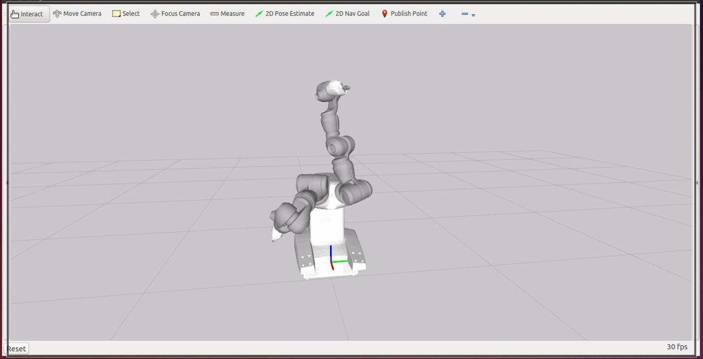
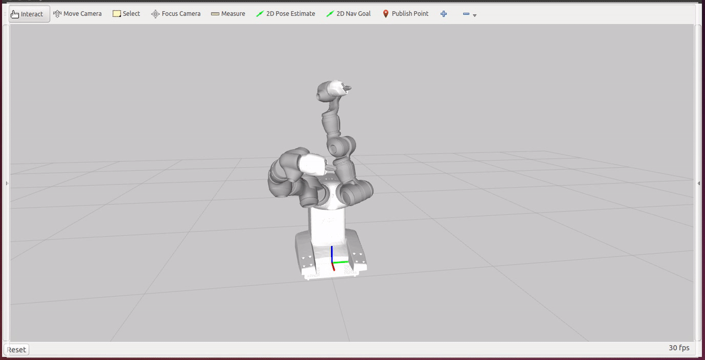
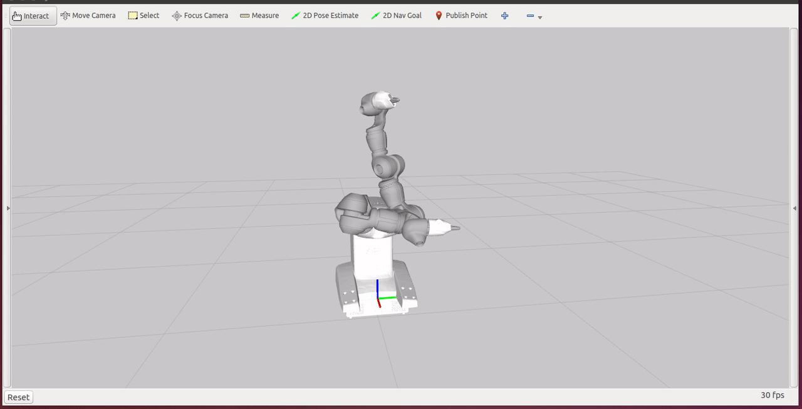
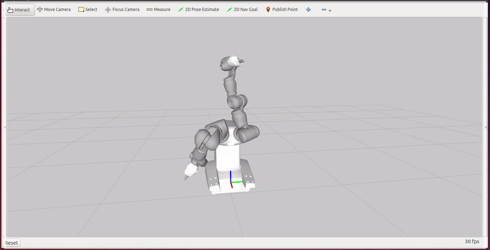

**An implementation of the Deep Deterministic Policy Gradient (DDPG) algorithm using Keras/Tensorflow with the robot simulated using ROS/Gazebo/MoveIt!** 

## Introduction

Reinforcement learning is a technique can be used to learn how to complete a task by performing the appropriate actions in the correct sequence. The input to this algorithm is the *state* of the world which is used by the algorithm to select an *action* to perform. Upon execution of this *action* , the algorithm receives a *reward* indicating completion of the task and/or progress towards completion. There is [much](https://en.wikipedia.org/wiki/Reinforcement_learning) [literature](http://webdocs.cs.ualberta.ca/~sutton/book/the-book.html) in this area so I won't explain in detail here. Recently, there has been some research work in the field combining deep learning with reinforcement learning. Some of this [work](https://deepmind.com/research/dqn/) dealt with a discrete action space and showed a DQN which was capable of playing Atari 2600 games. More recently this technique was [extended](https://www.google.com/url?sa=t&rct=j&q=&esrc=s&source=web&cd=1&cad=rja&uact=8&ved=0ahUKEwig9dy5_Y3RAhVIwlQKHZw5CIkQFggcMAA&url=https%3A%2F%2Farxiv.org%2Fpdf%2F1509.02971&usg=AFQjCNFuaeQSASuB5qhUJsNkLGE4QUD36Q&sig2=Q1mBsauWyRT3d7kX4Gdvxg) to a continuous action space with applications in robotics motion planning and playing racing games. 

## Motivation

I've been teaching myself machine learning for the past few years and had read about DeepMind's impressive work (DQN) when it first came out. As I continued working with ROS and progressing through the navigation stack, I saw new research using machine/deep learning to solve [grasping](http://arxiv.org/pdf/1603.02199) problems and reinforcement learning to perform motion planning. This piqued my curiosity and I started reading whatever I could get my hands on. I've always believed that there's only so much you can learn by reading; a lot more insight is gained by actually implementing. Thus I decided to do an implementation of Deep Deterministic Policy Gradient (DDPG) which had been demonstrated in robotic control applications. 

## Technical Approach

A recent [publication](http://arxiv.org/pdf/1610.00633) showed an implementation of DDPG for control of a 7-DoF robot arm but it used MuJoCo to simulate the robot arm. A google search told me that MuJoCo wasn't free so I decided to use ROS/Gazebo/MoveIt! which were free frameworks that I was familiar with. I hadn't seen an implementation of deep reinforcement learning for robotic control built on ROS so I figured this would be a good opportunity to contribute to the community. As for the deep learning framework, I used Keras mainly due to familiarity and very active community.  

Gazebo is a physics simulator that can be used as an alternative to MuJoCo and it has ROS bindings that allow for easy interfacing. Prior [work](https://arxiv.org/pdf/1610.00633.pdf) had shown control of the robot arm using a velocity interface but I decided to use a position interface that makes its cleaner to implement joint limits. This decision had implications which enabled me to take a non-traditional approach towards simulation of the robot arm. 

I had played around with the [ur_gazebo](http://wiki.ros.org/ur_gazebo) package but due to it lacking a gripper, I decided to look at other robots. Baxter, Fetch were obvious options but both were a little more complex that what I was looking for. Finally, I settled on the YuMi because its pretty simple and I found some ROS [packages](https://github.com/OrebroUniversity/yumi) for it which I modified to include gazebo support. 

After an initial implementation of the YuMi robot in Gazebo, I realized that the simulation steps took too long so I messed around with the max_step_size and realtime_update_rate but I saw "controller execution failed" messages if I tried to go too fast. If any ros_control developers reading this, I had this issue with the ur5 arm also so I think its a ros_control/gazebo/moveit issue. 

While searching for a solution to the gazebo issue, I came across [this](http://answers.ros.org/question/71824/gazebo-and-moveit-moveitsimplecontrollermanager-and-sending-joint-trajectory-messages/?answer=72091#post-id-72091) post which was an ah-ha moment for me. I didn't need a physics sim because I was using a position control interface which took care of gravity for me !  I dropped gazebo and started using a kinematic sim using moveit's fake controller manager to do the execution. While the kinematics simulation ran faster than the physics simulation it still wasn't fast enough due to the collision checking and path planning. Anyhow, after a few iterations training DDPG using the kinematic sim., I wasn't achieving the accuracy I wanted (<1cm) and the NN wasn't converging for many starting configurations. After some investigation, the cause for this turned out to be the fact that I was training a motion planner (DDPG-NN) on top of a motion planner (MoveIt!) so the NN that approximated the rewards wasn't achieving good accuracy.  Thus came the last (and final) iteration of the robot simulation setup - I wrote a node that directly published joint states and used robot_state_publisher to publish the tf's. MoveIt was completely out of the picture and so was Gazebo. It turns out this runs quite fast as well !  

The implementation of DDPG was pretty straightforward. I won't explain the theory behind it as there are many resources explaining bellman equations and such. Basically, DDPG is a version of Actor-Critic Reinforcement Learning where a deep NN is used as function approximater to predict the rewards (given state/action pairs) and actions (given the current state). One of the important points to keep in mind is that the NN can't be used directly during the training due to instability so we implement a copy of each of the NN's called a target network which is updated slowly (aka off-policy temporal difference learning). This target network is used to estimate the future Q-values which reduces oscillations in the training. 

Implementing a NN in Keras is pretty straightforward but one caveat is that the gradient of the critic network is used to update the actor network. I wasn't sure how to get the gradient of one NN and apply to another and while reading about it I came across a Keras [implementation](https://yanpanlau.github.io/2016/10/11/Torcs-Keras.html) of DDPG that was hooked up to a racing game. Its turns out this author implemented the gradient updates using low-level tensorflow primitives. Their code was simple to understand and so similar to what I had implemented so far that I decided to use huge portions of their code directly. Much credit goes to them for sharing their implementation - I'm sure it saved me tons of debugging hours. 

Design of the reward function is also one of the critical points in the implementation. Sparse rewards lead to a lot of exploration and you have a credit assignment problem. To ease these issues, I implemented a reward proportional to the distance to the target. This kind of 'guided exploration' led to faster learning. To acheive high-accuracy (<1cm) I augmented the euclidean distance reward with its log so that the combined reward would approach infinity asymptotically as the distance reached zero.  

The state consisted of the current joint angles of the arm, the current position of the end-effector in cartesian space and the target position in cartesian coordinates.  A new target position was used for each episode by sampling a 0.25 $m^3$ box around the origin with each episode running for 50 steps. The actions were performed in joint-space which meant the algorithm had raw control of the robot joints. The critic NN needs to approximate the following formula:

$reward = norm(targetCartesianCoordinates-(currentCartesianCoordinates + convert2CartesianSpace(jointSpaceActions))$

## Results

Here are some videos of the robot arm achieving different target poses from different starting positions. 

## Conclusions 

I started working on this implementation as a way to teach myself deep reinforcement learning. Along the way I found that the simulation setup can affect the quality of learning and also the time to complete the training. I also found that it is not easy to examine/understand the internal states of the reinforcement learning algorithm. Lastly, engineering a good reward function goes a long way towards acheiving high-accuracy results in a short period of time.  

